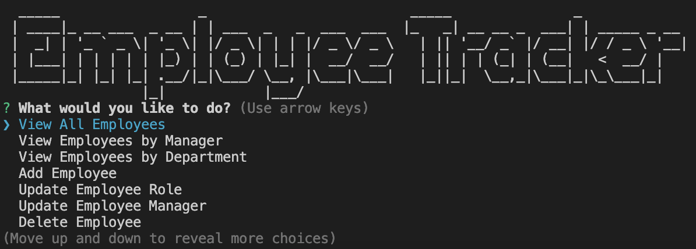

# Employee Tracker

## Description

Create an application to easily view and interact with company information stored in a mySQL database.
This application uses Node.js, Express.js. and MySQL.

## Table of Contents

- [Installation](#installation)
- [Usage](#usage)
- [Tests](#tests)
- [Questions](#questions)

## Installation

Create a local .env file, filling in the appropriate database username and password:  
```
DB_NAME='company_db'  
DB_USER=''  
DB_PASSWORD=''
```

To install dependencies:
```npm i```

## Usage

To run application:
```npm start```

Example of welcome screen and employee related questions:



Video demonstrating application: [Employee Tracker Demo](https://drive.google.com/file/d/1qmagufIJbqilTrqF9cmspx_ASAhua3DU/view?usp=sharing)

---

## Tests

No tests

## Questions

Take a look at my other projects: [GitHub Profile](https://github.com/matthkang)

You can reach me via email at: [matthkang@gmail.com](mailto:matthkang@gmail.com)
